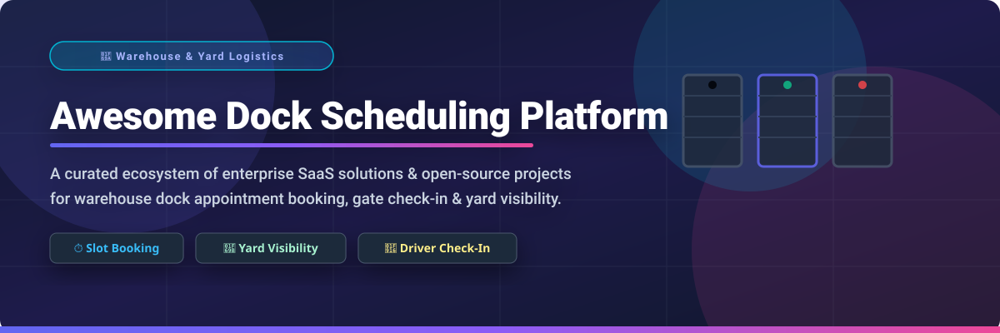

  

  
  
  
  
  
  
  

# 🚚 Awesome Dock Scheduling Platform

> **A curated ecosystem of commercial SaaS platforms & open-source projects for Warehouse Dock Appointment Automation, Yard Visibility & Carrier Collaboration.**

Welcome to the comprehensive directory of **Dock Scheduling Platforms** and **Yard Management Systems (YMS)**. These tools automate dock appointment booking, digitize gate check-in, optimize trailer movements, eliminate detention fees, and provide real-time visibility into warehouse operations for shippers, 3PLs, carriers, and distribution centers.

---

## 📑 Table of Contents

- [📊 Sector Market Overview](#-sector-market-overview)
- [🏢 SaaS & Hosted Commercial Platforms](#-saas--hosted-commercial-platforms)
- [💻 Open-Source GitHub Projects](#-open-source-github-projects)
- [🛠️ How to Contribute](#️-how-to-contribute)
- [⚠️ Disclaimer](#️-disclaimer)
- [💖 Support & Community](#-support--community)
- [📈 Star History](#-star-history)

---

## 📊 Sector Market Overview

> 🌐 **Market Size & Fragmentation Analysis**:  
> The global **Dock Scheduling & Yard Management Software** market is currently estimated at **$1.8 Billion to $3.5 Billion** and is projected to reach **$6.2 Billion by 2032**, growing at a CAGR of ~11.5%.  
> The sector is **highly fragmented**, comprising a combination of enterprise Supply Chain Management (SCM) giants (such as Blue Yonder and Descartes), specialized real-time visibility platforms (FourKites, Transporeon), and niche dedicated dock appointment SaaS solutions (Opendock, GoRamp). No single provider holds a monopoly, as logistics operators frequently choose modular tools based on carrier connectivity, TMS/WMS integration needs, and facility scale.

---

## 🏢 SaaS & Hosted Commercial Platforms

Below is the structured breakdown of top commercial SaaS platforms for dock scheduling and yard management, sorted by **Company Size / Estimated Annual Revenue** (descending).

| 🏢 Platform | 💰 Est. Company Size (Revenue / Valuation) | 💵 Starting Tier Pricing | 🎁 Free Tier / Trial Details | ⚡ Core Features & Capabilities |
| :--- | :--- | :--- | :--- | :--- |
| **[Blue Yonder Network Appointment Scheduling](https://www.blueyonder.com/)** | **$1.42 Billion** Annual Revenue *(Panasonic Subsidiary)* | **$15,000 / year** *(Enterprise base site tier)* | **30-Day Enterprise Sandbox / POC** *(Guided enterprise evaluation)* | Cloud-based appointment scheduling connected to 12,000+ carrier network. Features predictive ETAs, constraint-based booking, and automated audit trails. |
| **[Descartes Dock Appointment Scheduling](https://www.descartes.com/)** | **$729 Million** Annual Revenue *(Public: NASDAQ: DSGX)* | **$8,000 / year** *(Base site license)* | **14-Day Guided Sandbox** *(Available upon sales request)* | Carrier self-scheduling portal, automated milestone notifications, recurring booking rules, and seamless TMS/WMS integration. |
| **[Transporeon Time Slot Management](https://www.transporeon.com/)** | **~$130 Million** Annual Revenue *(Trimble Subsidiary)* | **$5,000 / facility / year** base | **Free Carrier Portal Access** *(14-day shipper trial on request)* | Dynamic loading capacity optimization, automated arrival adjustments, and carrier slot self-booking. Reduces waiting times up to 40%. |
| **[FourKites Appointment Manager](https://www.fourkites.com/)** | **$114.3 Million** Annual Revenue *($1.0B Valuation)* | **$500 / month** per site *(Advanced tier)* | **Free Basic Tier** *(Unlimited carrier booking & standard slot access)* | Free facility appointment manager, email-free scheduling workflow, real-time yard tracking, and ERP/TMS integration. |
| **[Opendock](https://www.opendock.com/)** | **~$12.0 Million** Annual Revenue *(Loadsmart Subsidiary)* | **$250 / month** per facility | **14-Day Free Trial** *(Full carrier self-scheduling features)* | Intuitive carrier self-booking portal, interactive calendar grid, warehouse floor TV mode display, two-way SMS, and API integration. |
| **[C3 Reservations](https://www.c3solutions.com/)** | **~$3.6 Million** Annual Revenue | **$600 / month** per site | **30-Day Enterprise Pilot** *(Custom pilot account for qualified sites)* | Enterprise web-based dock scheduling, complex constraint modeling, standing appointments, multi-site visibility, and 24/7 carrier portal. |
| **[GoRamp](https://www.goramp.com/)** | **~$3.2 Million** Annual Revenue | **$175 / month** *(Billed annually)* | **14-Day Free Trial** *(Up to 1 facility & 50 bookings/month)* | All-in-one dock and yard orchestration, driver self-check-in kiosk, yard visibility, and automated ERP/TMS API & EDI synchronization. |
| **[Shiptify](https://www.shiptify.com/)** | **~$3.0 Million** Annual Revenue | **€150 / month** base plan | **14-Day Free Trial** *(Commitment-free zone/dock module)* | Precise dock door slot planning, capacity control by logistics niche, flexible opening hour rules, and hidden internal constraints. |
| **[YardView](https://www.yardview.com/)** | **~$2.5 Million** Annual Revenue | **$450 / month** per facility | **14-Day Demo Pilot Account** *(Guided setup for yard teams)* | Purpose-built yard management and dock scheduling since 1998. Features gate access control, yard driver tasking, and real-time trailer tracking. |

---

## 💻 Open-Source GitHub Projects

Self-hosted engines, resource reservation frameworks, and AI skills suitable for building custom dock door appointment booking and yard management systems. Repositories are sorted by **GitHub Star Count** (descending).

| 📦 Repository & Link | ⭐ Star Count Badge | 📜 License / Tech Stack | 🎯 Logistics & Scheduling Relevance |
| :--- | :--- | :--- | :--- |
| **[Cal.com](https://github.com/calcom/cal.com)** |  | **AGPL-3.0**   Next.js, TypeScript | Open-source scheduling infrastructure adaptable for warehouse dock door slot booking, carrier appointments, and facility availability management. |
| **[Easy!Appointments](https://github.com/alextselegidis/easyappointments)** |  | **GPL-3.0**   PHP, CodeIgniter | Highly customizable web booking application supporting flexible time slots, resource availability, and carrier arrival windows. |
| **[LibreBooking](https://github.com/LibreBooking/librebooking)** |  | **GPL-3.0**   PHP, MariaDB | Active fork of Booked / phpScheduleIt. Resource reservation platform featuring recurring bookings, conflict detection, and REST API for dock doors. |
| **[Thunderbird Appointment](https://github.com/thunderbird/appointment)** |  | **MPL-2.0**   Python, Django | Open-source calendar appointment booking system allowing carriers to reserve time slots within warehouse operating hours. |
| **[Django Appointment](https://github.com/adamspd/django-appointment)** |  | **MIT**   Python, Django | Modular appointment engine with conflict prevention and slot customization, ideal for integration into custom WMS/TMS platforms. |
| **[Tymeslot](https://github.com/Tymeslot/tymeslot)** |  | **MIT**   Elixir, LiveView | High-performance real-time meeting and time-slot scheduling application built for high-throughput reservation workflows. |
| **[Respa Resource Reservation Engine](https://github.com/City-of-Helsinki/respa)** |  | **MIT**   Python, Django | Enterprise resource reservation backend designed for managing physical locations, loading bays, equipment, and access control. |
| **[Dock Door Assignment AI Skill](https://github.com/kishorkukreja/awesome-supply-chain)** |  | **MIT**   AI Prompt / Skill | AI agent skill for optimizing inbound/outbound dock door assignments, reducing truck dwell times, and resolving yard bottlenecks. |
| **[Yard Lense on Edge](https://www.iml.fraunhofer.de/en/fields_of_activity/material-flow-systems/software_engineering/yard-lense-on-edge-ai-supported-yard-logistics-in-real-time.html)** | *(Silicon Economy)* | **Open-Source AI**   Python, Edge CV | Computer-vision AI yard management system by Fraunhofer IML. Detects vehicles, reads license plates, and tracks trailers in real time without cloud dependency. |

---

## 🛠️ How to Contribute

We welcome community contributions to keep this list updated and comprehensive!

1. **Fork** the repository.
2. Add or update entries in `README.md` following the tabular formats above.
3. Ensure entries include accurate pricing, trial details, or star counts.
4. Open a **Pull Request** with a clear explanation of your additions.

---

## ⚠️ Disclaimer

- This repository is a **community-curated overview** for educational and informational purposes — not an explicit endorsement.
- Dock scheduling systems handle critical operational logistics data. Self-hosted options require proper security hardening and data retention policies.
- Commercial prices and feature availability may change over time. Please verify current plans directly on official vendor websites.

---

## 💖 Support & Community

Thank you for exploring the **Awesome Dock Scheduling Platform** repository! If you find this curated list helpful for your warehouse, logistics, or supply chain projects:

- ⭐ **Star this repository** to help others discover it.
- 🔀 **Fork & Contribute** new tools, updates, or open-source solutions.
- 📢 **Share** with warehouse managers, 3PL operators, and supply chain developers.
- ☕ **Sponsor**: Support ongoing open-source curation on the [GitHub Sponsor Dashboard](https://github.com/sponsors/ishandutta2007).

---

## 📈 Star History

---

  Maintained with ❤️ for warehouse managers, 3PL operators, logistics coordinators, and supply chain technologists worldwide.

